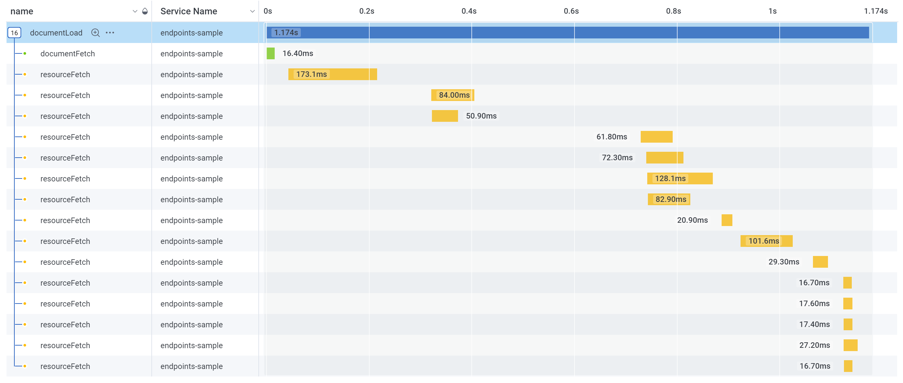

# Getting started

To monitor **application performance**, Workleap has adopted [Honeycomb](https://www.honeycomb.io/), a tool that helps teams capture and analyze **distributed traces** and metrics to understand and monitor complex systems, application behaviors, and performance. Built on [OpenTelemetry](https://opentelemetry.io/), Honeycomb provides a robust API for frontend telemetry.

While Honeycomb's in-house [HoneycombWebSDK](https://docs.honeycomb.io/send-data/javascript-browser/honeycomb-distribution/) includes great default instrumentation, this package provides a slightly altered default instrumentation which is adapted for Workleap's applications' requirements. 

## Install the packages

First, open a terminal at the root of the application and install the following packages:

```bash
pnpm add @workleap/honeycomb @opentelemetry/api
```

## Register instrumentation

Then, update the application bootstrapping code to register Honeycomb instrumentation using the [registerHoneycombInstrumentation](./reference/registerHoneycombInstrumentation.md) function:

```tsx !#6-9,15,17 index.tsx
import { registerHoneycombInstrumentation, HoneycombInstrumentationClientProvider, createTelemetryContext } from "@workleap/honeycomb/react";
import { StrictMode } from "react";
import { createRoot } from "react-dom/client";
import { App } from "./App.tsx";

const client = registerHoneycombInstrumentation("sample", "my-app", [/.+/g,], {
    proxy: "https://sample-proxy",
    telemetryContext: createTelemetryContext()
});

const root = createRoot(document.getElementById("root")!);

root.render(
    <StrictMode>
        <HoneycombInstrumentationClientProvider value={client}>
            <App />
        </HoneycombInstrumentationClientProvider>
    </StrictMode>
);
```

!!!warning
Avoid using `/.+/g,` in production, as it could expose customer data to third parties. Instead, ensure you specify values that accurately matches your application's backend URLs.
!!!

!!!warning
We recommend using an [OpenTelemetry collector](https://docs.honeycomb.io/send-data/opentelemetry/collector/) with an authenticated proxy over an ingestion [API key](https://docs.honeycomb.io/get-started/configure/environments/manage-api-keys/#create-api-key), as API keys can expose Workleap to potential attacks.
!!!

With instrumentation in place, a few traces are now available 👇

### Fetch requests

Individual fetch request performance can be monitored from end to end:

:::align-image-left

:::

### Document load

The loading performance of the DOM can be monitored:

:::align-image-left

:::

### Unmanaged error

When an unmanaged error occurs, it's automatically recorded:

:::align-image-left

:::

### Real User Monitoring (RUM)

The default instrumentation will automatically track the appropriate metrics to display RUM information:

:::align-image-left
{width=536 height=378}
:::
:::align-image-left
{width=536 height=378}
:::
:::align-image-left
{width=532 height=358}
:::

### LogRocket session URL

If [LogRocket instrumentation](../logrocket/getting-started.md) is registered, Honeycomb traces are enriched with the LogRocket session URL as soon as it becomes available:

:::align-image-left
{width=328}
:::

### Correlation ids

The `registerLogRocketInstrumentation` function automatically adds two attributes to every trace:

- `app.telemetry_id`: Identifies a single application load. It's primarily used to correlate Honeycomb traces with the other telemetry platforms.
- `app.device_id`: Identifies the user's device across sessions. This value is extracted from the shared `wl-identity` cookie, which is used across Workleap's marketing sites and web applications.

:::getting-started-correlation-ids
{width=308}
{width=310}
:::

## Set custom user attributes

Most applications need to set custom attributes about the current user environment on all traces. To help with that, [HoneycombInstrumentationClient](./reference/HoneycombInstrumentationClient.md) expose the [setGlobalSpanAttributes](./reference/HoneycombInstrumentationClient.md#methods) method:

```ts !#5-7
import { useHoneycombInstrumentationClient } from "@workleap/honeycomb/react";

const client = useHoneycombInstrumentationClient();

client.setGlobalSpanAttributes({
    "app.user_id": "123"
});
```

Now, every trace recorded after the execution of `setGlobalSpanAttributes` will include the custom attribute `app.user_id`:

:::align-image-left
{width=204 height=161}
:::

## Integrate with LogRocket

Starting with version `7.0`, attaching LogRocket session replays to Honeycomb traces requires providing a [LogRocketInstrumentationClient](../logrocket/reference/LogRocketInstrumentationClient.md) to the registration function:

```tsx !#7,12
import { registerHoneycombInstrumentation, HoneycombInstrumentationClientProvider, createTelemetryContext } from "@workleap/honeycomb/react";
import { registerLogRocketInstrumentation } from "@workleap/logrocket/react";
import { StrictMode } from "react";
import { createRoot } from "react-dom/client";
import { App } from "./App.tsx";

const logRocketInstrumentationClient = registerLogRocketInstrumentation("app-id");

const honeycombInstrumentationClient = registerHoneycombInstrumentation("sample", "my-app", [/.+/g,], {
    proxy: "https://sample-proxy",
    telemetryContext: createTelemetryContext(),
    logRocketInstrumentationClient
});

const root = createRoot(document.getElementById("root")!);

root.render(
    <StrictMode>
        <HoneycombInstrumentationClientProvider value={client}>
            <App />
        </HoneycombInstrumentationClientProvider>
    </StrictMode>
);
```

## Custrom traces

Have a look at the [custom traces](./custom-traces.md) page.

## Try it :rocket:

Start the application in a development environment using the `dev` script. Render a page, then navigate to your [Honeycomb](https://ui.honeycomb.io/) instance. Go to the "Query" page and type `name = HTTP GET` into the "Where" input. Run the query, select the "Traces" tab at the bottom of the page and view the detail of a trace. You should view information about the request.

### Troubleshoot issues

If you are experiencing issues with this guide:

- Set the [verbose](./reference/registerHoneycombInstrumentation.md#verbose) predefined option to `true`.
- Open the [DevTools](https://developer.chrome.com/docs/devtools/) console. Look for logs starting with `[honeycomb]`.
- You should also see a log entry for every Honeycomb traces.
    - `honeycombio/opentelemetry-web: Honeycomb link: https://ui.honeycomb.io/...`
- Refer to the sample on [GitHub](https://github.com/workleap/wl-telemetry/tree/main/samples/honeycomb).

## Filter by correlation ids

When a [TelemetryContext](./reference/createTelemetryContext.md#telemetrycontext) instance is provided, the `registerLogRocketInstrumentation` function adds two user traits to every session replay to **unify** LogRocket with the **other telemetry platforms**:

- `app.telemetry_id`: Identifies a single application load. It's primarily used to correlate Honeycomb traces with the other telemetry platforms.
- `app.device_id`: Identifies the user's device across sessions. This value is extracted from the shared `wl-identity` cookie, which is used across Workleap's marketing sites and web applications.

To correlate a session with other telemetry platforms, filter the query with the `app.telemetry_id` or `app.device_id` fields into the "Where" input.
