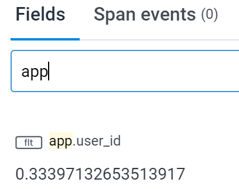

# Honeycomb features

To monitor **application performance**, Workleap has adopted [Honeycomb](https://www.honeycomb.io/), a tool that helps teams capture and analyze **distributed traces** and metrics to understand and monitor complex systems, application behaviors, and performance. Built on [OpenTelemetry](https://opentelemetry.io/), Honeycomb provides a robust API for frontend telemetry.

While Honeycomb's in-house [HoneycombWebSDK](https://docs.honeycomb.io/send-data/javascript-browser/honeycomb-distribution/) includes great default instrumentation, the `@workleap/telemetry` package provides a slightly altered default instrumentation which is adapted for Workleap's applications' requirements.

## Default instrumentation

Workleap’s Honeycomb instrumentation includes a few default traces 👇

### Fetch requests

Individual fetch request performance can be monitored from end to end:

:::align-image-left

:::

### Document load

The loading performance of the DOM can be monitored:

:::align-image-left

:::

### Unmanaged error

When an unmanaged error occurs, it's automatically recorded:

:::align-image-left

:::

### Real User Monitoring (RUM)

Performance data is collected from real user sessions to generate metrics and insights: 

:::align-image-left
{width=536 height=378}
:::
:::align-image-left
{width=536 height=378}
:::
:::align-image-left
{width=532 height=358}
:::

## Correlation ids

Two correlation ids are automatically added to every trace:

- `app.telemetry_id`: Identifies a single application load. It's primarily used to correlate Honeycomb traces with the other telemetry platforms.
- `app.device_id`: Identifies the user's device across sessions. This value is extracted from the shared `wl-identity` cookie, which is used across Workleap's marketing sites and web applications.

:::getting-started-correlation-ids
{width=308}
{width=310}
:::

## LogRocket session URL

If LogRocket instrumentation is enabled, Honeycomb traces are enriched with the LogRocket session URL as soon as it becomes available:

:::align-image-left
{width=328}
:::

## Set custom attributes

Most applications need to set custom attributes about the current user environment on all traces. To help with that, [HoneycombInstrumentationClient](../../reference/telemetry/HoneycombInstrumentationClient.md) expose the [setGlobalSpanAttributes](../../reference/telemetry/HoneycombInstrumentationClient.md#methods) method:

```ts !#5-7
import { useHoneycombInstrumentationClient } from "@workleap/honeycomb/react";

const client = useHoneycombInstrumentationClient();

client.setGlobalSpanAttributes({
    "app.user_id": "123"
});
```

Now, every trace recorded after the execution of `setGlobalSpanAttributes` will include the custom attribute `app.user_id`:

:::align-image-left
{width=204 height=161}
:::
