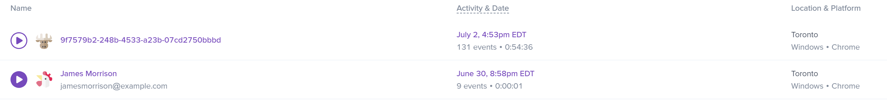
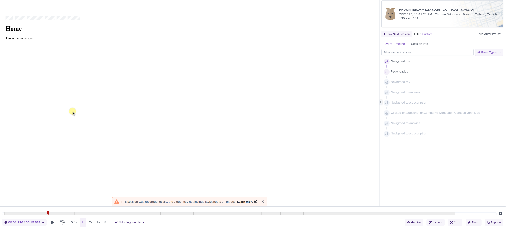
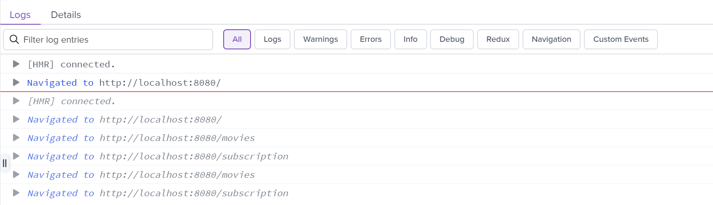
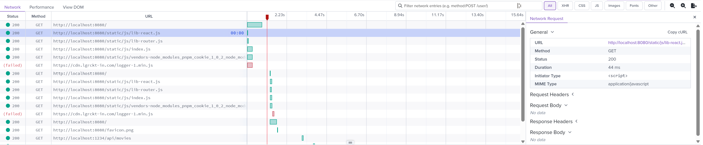
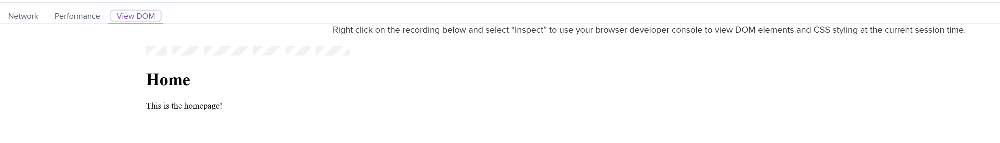
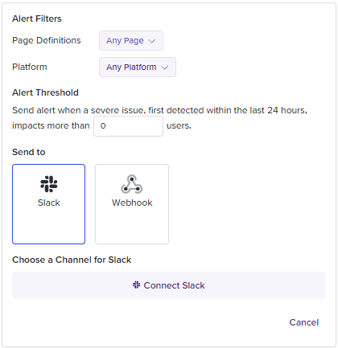

# LogRocket features

!!!warning
If telemetry hasn't been set up for your project yet, please refer to the [setup guide](../setup-project.md) before continuing.
!!!

To gain full visibility into **frontend behavior** in **production**, Workleap has adopted [LogRocket](https://logrocket.com/), a tool that combines session replay, performance tracking, error logging, and issues tracking to help **surface**, **understand** and resolve **issues** in **production**.

The `@workleap/telemetry` package provides default LogRocket instrumentation tailored to Workleap's applications' needs, including the **removal** of **sensitive information** from HTML documents, HTTP requests/responses and URLs.

## Session replays

With instrumentation in place, [session replays](https://docs.logrocket.com/docs/session-replay) are now available in LogRocket:

:::align-image-left

:::

Session replays offer a wide range of features to help debug production issues, including the following :point_down:

#### Playback

:::align-image-left

:::

#### Console logs

:::align-image-left
{width=794}
:::

#### Network requests

:::align-image-left

:::

#### DOM interactions

:::align-image-left

:::

## Surface issues

[Galileo](https://logrocket.com/products/galileo-ai), LogRocket's proprietary AI, watches every session and tracks product changes to proactively surface issues that are impacting users.

#### Triage

Galileo highlights recurring issues so you can triage them quickly:

:::align-image-left

:::

#### Digest

A daily or weekly digest of newly detected and untriaged issues can be delivered to Slack:

:::align-image-left
{width=408}
:::

#### Alert

Impactful issues flagged by Galileo AI can be delivered immediatly to Slack:

:::align-image-left

:::

## Record elements

By default, this package instrumentation sanitizes all user-provided text inputs and content. This includes:

- Form fields (like `<input>`, `<textarea>`)
- Text content inside HTML elements
- Dynamic DOM mutations containing text

Use `data-public` to explicitly allow LogRocket to record the content of an element. When this attribute is present, the content inside the element (including child elements) will be captured in the session replay:

```html
<div data-public>
    This text will be visible in the session replay.
</div>
```

!!!tip
To learn more about the built-in privacy settings of this instrumentation, refer to the [Privacy](./privacy.md) page.
!!!

## Correlation ids

Two correlation ids are automatically added to each session and can be used to filter sessions by user traits:

- `Telemetry Id`: Identifies a single application load. It's primarily used to correlate Honeycomb traces with the other telemetry platforms.
- `Device Id`: Identifies the user's device across sessions. This value is extracted from the shared `wl-identity` cookie, which is used across Workleap's marketing sites and web applications.

## Identify a user

Most applications need to identify the current user environment. To help with that, [LogRocketInstrumentationClient](../../reference/telemetry/LogRocketInstrumentationClient.md) expose the [createWorkleapPlatformDefaultUserTraits](../../reference/telemetry/LogRocketInstrumentationClient.md#methods) and [createShareGateDefaultUserTraits](../../reference/telemetry/LogRocketInstrumentationClient.md#methods) methods. When used with [LogRocket.identify](https://docs.logrocket.com/reference/identify), it provides all the tools to identify a  user with the key information that we track at Workleap:

### Workleap Platform

```ts !#6-13,15
import { useLogRocketInstrumentationClient } from "@workleap/telemetry/react";
import LogRocket from "logrocket";

const client = useLogRocketInstrumentationClient();

const traits = client.createWorkleapPlatformDefaultUserTraits({
    userId: "6a5e6b06-0cac-44ee-8d2b-00b9419e7da9",
    organizationId: "e6bb30f8-0a00-4928-8943-1630895a3f14",
    organizationName: "Acme",
    isMigratedToWorkleap: true,
    isOrganizationCreator: false,
    isAdmin: false
});

LogRocket.identify(traits.userId, traits);
```

### ShareGate

```ts !#6-11,13
import { useLogRocketInstrumentationClient } from "@workleap/telemetry/react";
import LogRocket from "logrocket";

const client = useLogRocketInstrumentationClient();

const traits = client.createShareGateDefaultUserTraits({
    shareGateAccountId: "cd7fb5ca-f13d-420f-9a87-637b3419d242",
    microsoftUserId: "e9bb1688-a68b-4235-b514-95a59a7bf8bc",
    microsoftTenantId: "86bea6e5-5dbb-43c9-93a4-b10bf91cc6db",
    workspaceId: "225e6494-c008-4086-ac80-3770aa47085b"
});

LogRocket.identify(traits.shareGateAccountId, traits);
```

## Get the session URL

Every session replay is associated with a unique URL. To register a callback receiving the session replay once it's available, use the [LogRocket.getSessionURL](https://docs.logrocket.com/reference/get-session-url) function:

```ts !#3-5 index.tsx
import LogRocket from "logrocket";

LogRocket.getSessionUrl(url => {
    console.log(url);
});
```

## Capture logs

By default, Workleap's LogRocket configuration does not capture console logs. To send loggers output to LogRocket, use the [LogRocketLogger](../../reference/LogRocketLogger.md) class.

```tsx !#8,25,29 index.tsx
import { initializeTelemetry, LogRocketLogger, TelemetryProvider } from "@workleap/telemetry/react";
import { registerCommonRoomInstrumentation, CommonRoomInstrumentationProvider } from "@workleap/common-room/react";
import { LogLevel, type RootLogger } from "@workleap/logging";
import { StrictMode } from "react";
import { createRoot } from "react-dom/client";
import { App } from "./App.tsx";

const loggers: RootLogger[] = [new LogRocketLogger({ logLevel: LogLevel.information })];

const telemetryClient = initializeTelemetry("sg", {
    logRocket: {
        appId: "my-app-id"
    },
    honeycomb: {
        namespace: "sample",
        serviceName: "my-app",
        apiServiceUrls: [/.+/g],
        options: {
            proxy: "https://sample-proxy"
        }
    },
    mixpanel: {
        envOrTrackingApiBaseUrl: "development"
    },
    loggers
});

const commonRoomClient = registerCommonRoomInstrumentation("my-site-id", {
    loggers
});

const root = createRoot(document.getElementById("root")!);

root.render(
    <StrictMode>
        <TelemetryProvider client={telemetryClient}>
            <CommonRoomInstrumentationProvider client={commonRoomClient}>
                <App />
            </CommonRoomInstrumentationProvider>
        </TelemetryProvider>
    </StrictMode>
);
```

!!!info
Console logs are not captured by default to reduce the risk of exposing Personally Identifiable Information (PII) in LogRocket session replays.
!!!

To troubleshoot an production issue, remove the `LogLevel` from the `LogRocketLogger` constructor options and set the `verbose` option to `true`:

```tsx !#8,25,30 index.tsx
import { initializeTelemetry, LogRocketLogger, TelemetryProvider } from "@workleap/telemetry/react";
import { registerCommonRoomInstrumentation, CommonRoomInstrumentationProvider } from "@workleap/common-room/react";
import { type RootLogger } from "@workleap/logging";
import { StrictMode } from "react";
import { createRoot } from "react-dom/client";
import { App } from "./App.tsx";

const loggers: RootLogger[] = [new LogRocketLogger()];

const telemetryClient = initializeTelemetry("sg", {
    logRocket: {
        appId: "my-app-id"
    },
    honeycomb: {
        namespace: "sample",
        serviceName: "my-app",
        apiServiceUrls: [/.+/g],
        options: {
            proxy: "https://sample-proxy"
        }
    },
    mixpanel: {
        envOrTrackingApiBaseUrl: "development"
    },
    verbose: true,
    loggers
});

const commonRoomClient = registerCommonRoomInstrumentation("my-site-id", {
    verbose: true,
    loggers
});

const root = createRoot(document.getElementById("root")!);

root.render(
    <StrictMode>
        <TelemetryProvider client={telemetryClient}>
            <CommonRoomInstrumentationProvider client={commonRoomClient}>
                <App />
            </CommonRoomInstrumentationProvider>
        </TelemetryProvider>
    </StrictMode>
);
```
