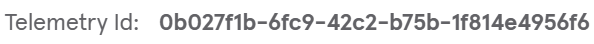
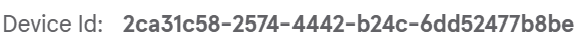
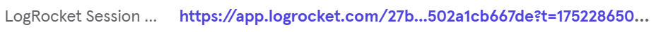

# Mixpanel features

!!!warning
If telemetry hasn't been set up for your project yet, please refer to the [setup guide](../setup-project.md) before continuing.
!!!

To make data-informed decisions, understand user behavior, and measure product impact, Workleap has adopted [Mixpanel](https://mixpanel.com/), an analytics platform that helps **understand how users interact with** a **product**.

The `@workleap/telemetry` package add basic Mixpanel tracking capabilities to an application. It provides a single `track` function that sends `POST` requests to a dedicated tracking endpoint compliant with the Workleap platform tracking API.

## Track an event

Events can be tracked by creating a tracking function with the [useMixpanelTrackingFunction](../../reference/telemetry/useMixpanelTrackingFunction.md) hook:

```ts !#3
import { useMixpanelTrackingFunction } from "@workleap/telemetry/react";

const track = useMixpanelTrackingFunction();
```

Then, use the returned `track` function to send a telemetry event:

```ts !#5
import { useMixpanelTrackingFunction } from "@workleap/telemetry/react";

const track = useMixpanelTrackingFunction();

track("ButtonClicked", { "Trigger": "ChangePlan", "Location": "Header" });
```

## Track an event for a target product

To track an action targeting another product, use the `targetProductId` option of [useMixpanelTrackingFunction](../../reference/telemetry/useMixpanelTrackingFunction.md):

```ts !#4
import { useMixpanelTrackingFunction } from "@workleap/telemetry/react";

const track = useMixpanelTrackingFunction({
    targetProductId
});

track("ButtonClicked", { "Trigger": "ChangePlan", "Location": "Header" });
```

## Track a link

To track a link click, use the `keepAlive` option to keep the page alive while the tracking request is being processed:

```ts !#6
import { useMixpanelTrackingFunction } from "@workleap/telemetry/react";

const track = useMixpanelTrackingFunction();

track("LinkClicked", { "Trigger": "ChangePlan", "Location": "Header" }, {
    keepAlive: true
});
```

## Correlation ids

Two correlation ids are automatically added to every trace:

- `Telemetry Id`: Identifies a single application load. It's primarily used to correlate Honeycomb traces with the other telemetry platforms.
- `Device Id`: Identifies the user's device across sessions. This value is extracted from the shared `wl-identity` cookie, which is used across Workleap's marketing sites and web applications.

:::getting-started-correlation-ids
{width=297}
{width=292}
:::

## LogRocket session URL

If LogRocket instrumentation is enabled, Mixpanel events are enriched with the LogRocket session URL as soon as it becomes available:

:::align-image-left
{width=464}
:::

## Set global properties

Most applications need to set custom properties about the current user environment on all events. To help with that, [MixpanelClient](../../reference/telemetry/MixpanelClient.md) expose the [setGlobalEventProperties](../../reference/telemetry/MixpanelClient.md#methods) method:

```ts !#5-7
import { useMixpanelClient } from "@workleap/telemetry/react";

const client = useMixpanelClient();

client.setGlobalEventProperties({
    "User Id": "123" 
})
```

Now, every event recorded after the execution of `setGlobalEventProperties` will include the custom property `User Id`.

## Define scoped properties

If you want to scope custom properties to a specific section of the application, wrap it with the [MixpanelPropertiesProvider](../../reference/telemetry/MixpanelPropertiesProvider.md). Define the provider with a static object of Mixpanel properties, and all nested components using track will automatically append those properties to their events:

```tsx !#9,11
import { MixpanelPropertiesProvider } from "@workleap/telemetry/react";

const MixpanelProperties = {
    section: "User Form"
};

function App() {
    return (
        <MixpanelPropertiesProvider value={MixpanelProperties}>
            <NestedComponent />
        </MixpanelPropertiesProvider>
    )
}
```


