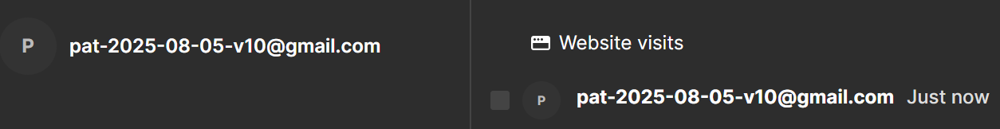

# Setup a project

Let's set up an application with all four Workleap's supported telemetry platforms.

## Install the packages

First, open a terminal at the root of the application and install the packages:

```bash
pnpm add @workleap/telemetry @workleap/common-room @opentelemetry/api logrocket
```

## Initialize telemetry libraries

And, update the application bootstrapping code to initialize the libraries with the [initializeTelemetry](../reference/telemetry/initializeTelemetry.md) and [registerCommonRoomInstrumentation](../reference/common-room/registerCommonRoomInstrumentation.md) functions:

```tsx !#7-23,25,31-32,34-35 index.tsx
import { initializeTelemetry, TelemetryProvider } from "@workleap/telemetry/react";
import { registerCommonRoomInstrumentation, CommonRoomInstrumentationProvider } from "@workleap/common-room/react";
import { StrictMode } from "react";
import { createRoot } from "react-dom/client";
import { App } from "./App.tsx";

const telemetryClient = initializeTelemetry({
    logRocket: {
        appId: "my-app-id"
    },
    honeycomb: {
        namespace: "sample",
        serviceName: "my-app",
        apiServiceUrls: [/.+/g],
        options: {
            proxy: "https://sample-proxy"
        }
    },
    mixpanel: {
        productId: "wlp",
        envOrTrackingApiBaseUrl: "development"
    }
});

const commonRoomClient = registerCommonRoomInstrumentation("my-site-id");

const root = createRoot(document.getElementById("root")!);

root.render(
    <StrictMode>
        <TelemetryProvider client={telemetryClient}>
            <CommonRoomInstrumentationProvider client={commonRoomClient}>
                <App />
            </CommonRoomInstrumentationProvider>
        </TelemetryProvider>
    </StrictMode>
);
```

!!!warning
For Honeycomb, avoid using `/.+/g`, in production, as it could expose customer data to third parties. Instead, ensure you specify values that accurately matches your application's backend URLs.
!!!

!!!warning
For Honeycomb, we recommend using an [OpenTelemetry collector](https://docs.honeycomb.io/send-data/opentelemetry/collector/) with an authenticated proxy over an ingestion [API key](https://docs.honeycomb.io/get-started/configure/environments/manage-api-keys/#create-api-key), as API keys can expose Workleap to potential attacks.
!!!

## Try it :rocket:

Start the application in a development environment using the `dev` script and test each platform.

### LogRocket

Render a page, then navigate to your [LogRocket](https://app.logrocket.com/) instance. Go to the "Session Replay" page, you should see a new session appear.

Troubleshoot issues:

- Set the [verbose](../reference/telemetry/initializeTelemetry.md#verbose-mode) predefined option to `true`.
- Open the [DevTools](https://developer.chrome.com/docs/devtools/) console and look for logs starting with `[logrocket]`.
- Refer to the sample on [GitHub](https://github.com/workleap/wl-telemetry/tree/main/samples/all-platforms).

### Honeycomb

Render a page, then navigate to your [Honeycomb](https://ui.honeycomb.io/) instance. Go to the "Query" page and type `name = HTTP GET` into the "Where" input. Run the query, select the "Traces" tab at the bottom of the page and view the detail of a trace. You should view information about the request.

Troubleshoot issues:

- Set the [verbose](../reference/telemetry/initializeTelemetry.md#verbose-mode) predefined option to `true`.
- Open the [DevTools](https://developer.chrome.com/docs/devtools/) console. Look for logs starting with `[honeycomb]`.
- You should also see a log entry for every Honeycomb traces.
    - `honeycombio/opentelemetry-web: Honeycomb link: https://ui.honeycomb.io/...`
- Refer to the sample on [GitHub](https://github.com/workleap/wl-telemetry/tree/main/samples/honeycomb).

### Mixpanel

Render a page, then navigate to your [Mixpanel](https://mixpanel.com/) instance. Go to "Events" page. If you are tracking events, you should see a new event appear.

Troubleshoot issues:

- Set the [verbose](../reference/telemetry/initializeTelemetry.md#verbose-mode) predefined option to `true`.
- Open the [DevTools](https://developer.chrome.com/docs/devtools/) console and look for logs starting with `[mixpanel]`.
- Refer to the sample on [GitHub](https://github.com/workleap/wl-telemetry/tree/main/samples/all-platforms).

### Common Room

Go to the "Identify" page and press the button to identify the current user. Then navigate to your [Common Room](https://app.commonroom.io/) instance and go to the "Activity" page, you should see new data appear in the **next 10 minutes**.

:::align-image-left

:::

Troubleshoot issues:

- Set the [verbose](../reference/telemetry/initializeTelemetry.md#verbose-mode) predefined option to `true`.
- Open the [DevTools](https://developer.chrome.com/docs/devtools/) console and look for logs starting with `[common-room]`.
- Refer to the sample on [GitHub](https://github.com/workleap/wl-telemetry/tree/main/samples/all-platforms).

### Correlation ids

Two correlation ids are attached to every session replay, event, and trace to **unify** the telemetry platforms. To verify they are attached correctly, try the correlation ids [troubleshooting example](./use-correlation-values.md#troubleshooting-example).

### LogRocket session URL

If LogRocket instrumentation is enabled, Honeycomb traces and Mixpanel events will automatically attach the LogRocket session URL. To verify the URL is attached correctly, try the LogRocket session replay URL [troubleshooting example](./use-correlation-values.md#troubleshooting-example-1).

## Learn more

:point_right: Explore the available features for each telemetry platform:

- [LogRocket](./learn-logrocket/features.md)
- [Honeycomb](./learn-honeycomb/features.md)
- [Mixpanel](./learn-mixpanel/features.md)
- [Common Room](../standalone-libraries/setup-common-room.md)

## Setup loggers

:point_right: Providing loggers to the initialization or registration functions is optionnal, but recommended to simplify troubleshooting. To set up loggers, follow the [guide](../guides/setup-loggers.md).

## Setup issues digest in Slack

:point_right: Set up a LogRocket [issues digest](https://docs.logrocket.com/docs/issues-digests) to receive Slack notifications for important issues surfaced by [Galileo AI](https://logrocket.com/products/galileo-ai).


