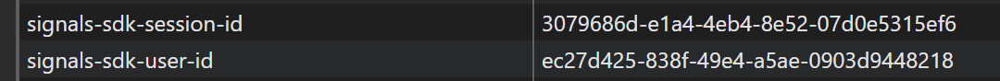

# Setup Common Room

To connect user activity across platforms and provide insight into community engagement and behavior, Workleap has adopted [Common Room](https://www.commonroom.io/), a marketers platform that aggregates data from sources like social media, forums, and product tools to build unified user profiles.

This package provides default Common Room instrumentation for Workleap applications.

## Install the packages

First, open a terminal at the root of the application and install the following packages:

```bash
pnpm add @workleap/common-room
```

## Register instrumentation

Then, register Common Room instrumentation using the [registerCommonRoomInstrumentation](#registercommonroominstrumentation) function:

```tsx !#6,12,14 index.tsx
import { registerCommonRoomInstrumentation, CommonRoomInstrumentationProvider } from "@workleap/common-room/react";
import { StrictMode } from "react";
import { createRoot } from "react-dom/client";
import { App } from "./App.tsx";

const client = registerCommonRoomInstrumentation("my-site-id");

const root = createRoot(document.getElementById("root")!);

root.render(
    <StrictMode>
        <CommonRoomInstrumentationProvider client={client}>
            <App />
        </CommonRoomInstrumentationProvider>
    </StrictMode>
);
```

## Identify a user

To associate the anonymous activities with an existing user, the [CommonRoomInstrumentationClient](#commonroominstrumentationclient) expose the [identify](#methods) method:

```ts !#5
import { useCommonRoomInstrumentationClient } from "@workleap/common-room/react";

const client = useCommonRoomInstrumentationClient();

client.identify("johndoe@contoso.com");
```

## Try it :rocket:

Start the application in a development environment using the dev script. Go to the "Identify" page and press the button to identify the current user. Then navigate to your [Common Room](https://app.commonroom.io/) instance and go to the "Activity" page, you should see new data appear in the **next 10 minutes**.

:::align-image-left

:::

### Troubleshoot issues

If you are experiencing issues with this guide:

- Set the [verbose](#verbose-mode) predefined option to `true`.
- Open the [DevTools](https://developer.chrome.com/docs/devtools/) console and look for logs starting with `[common-room]`.
- Refer to the sample on [GitHub](https://github.com/workleap/wl-telemetry/tree/main/samples/all-platforms).

#### Renew cookies

If nothing else works, renewing the Common Room cookies with new user id and session id values may help.

To do this, open the browser's developer tools, navigate to `Application` > `Storage` > `Cookies`, select the relevant site, and delete the `signals-sdk-session-id` and `signals-sdk-user-id` cookies.

Finally, refresh the page to generate new cookies.

:::align-image-left

:::

## Reference

### registerCommonRoomInstrumentation

Initialize [Common Room](https://www.commonroom.io/) instrumentation.

```ts
const client = registerCommonRoomInstrumentation(siteId, options?: { onReady, verbose })
```

#### Parameters

- `siteId`: The site id.
- `options`: An optional object literal of options:
    - `verbose`: If no `loggers` are configured, verbose mode will automatically send logs to the console. In some cases, enabling verbose mode also produces additional debug information.
    - `loggers`: An optional array of `RootLogger` instances.

#### Returns

A [CommonRoomInstrumentationClient](#commonroominstrumentationclient) instance.

#### Initialize with a site id

```ts !#3
import { registerCommonRoomInstrumentation } from "@workleap/common-room/react";

const client = registerCommonRoomInstrumentation("my-site-id");
```

#### Verbose mode 

```ts !#4
import { registerCommonRoomInstrumentation } from "@workleap/common-room/react";

const client = registerCommonRoomInstrumentation("my-site-id", {
    verbose: true
});
```

#### Use loggers

```ts !#6
import { registerCommonRoomInstrumentation } from "@workleap/common-room/react";
import { LogRocketLogger } from "@workleap/logrocket";
import { BrowserConsoleLogger, LogLevel } from "@workleap/logging";

const client = registerCommonRoomInstrumentation("my-site-id", {
    loggers: [new BrowserConsoleLogger(), new LogRocketLogger({ logLevel: LogLevel.information })]
});
```

### CommonRoomInstrumentationClient

A lightweight client providing access to Common Room instrumentation utilities.

```ts
const client = new CommonRoomInstrumentationClient(logger?)
```

#### Parameters

- `logger`: A `Logger` instance.

#### Methods

- `identify(emailAddress)`: Identify a [Common Room](https://www.commonroom.io/) user session using an email address. 

#### Usage

Once identified, any previous anonymous traces that share the same user id and session id will be linked to the email address. Additionally, any existing data associated with that email address will be attached to the current session.

```ts !#5
import { useCommonRoomInstrumentationClient } from "@workleap/common-room/react";

const client = useCommonRoomInstrumentationClient();

client.identify("johndoe@contoso.com");
```

### CommonRoomInstrumentationProvider

React provider to share a `CommonRoomInstrumentationProvider` instance with the application code.

```tsx
<CommonRoomInstrumentationProvider client={client}>
    <App />
</CommonRoomInstrumentationProvider>
```

#### Properties

- `client`: A [CommonRoomInstrumentationClient](#commonroominstrumentationclient) instance.

#### Provide a client instance

```tsx !#10,12
import { registerCommonRoomInstrumentation, CommonRoomInstrumentationProvider } from "@workleap/common-room/react";
import { createRoot } from "react-dom/client";
import { App } from "./App.tsx";

const client = registerCommonRoomInstrumentation("my-site-id")

const root = createRoot(document.getElementById("root"));

root.render(
    <CommonRoomInstrumentationProvider client={client}>
        <App />
    </CommonRoomInstrumentationProvider>
);
```

#### Retrieve a client instance

```ts !#3
import { useCommonRoomInstrumentationClient } from "@workleap/common-room/react";

const client = useCommonRoomInstrumentationClient();

client.identify("johndoe@contoso.com");
```

### useCommonRoomInstrumentationClient

Retrieve a `CommonRoomInstrumentationClient` instance.

```ts
const client = useCommonRoomInstrumentationClient()
```

#### Parameters

None

#### Returns

A [CommonRoomInstrumentationClient](#commonroominstrumentationclient) instance.

#### Usage

```ts !#3
import { useCommonRoomInstrumentationClient } from "@workleap/common-room/react";

const client = useCommonRoomInstrumentationClient();

client.identify("johndoe@contoso.com");
```


